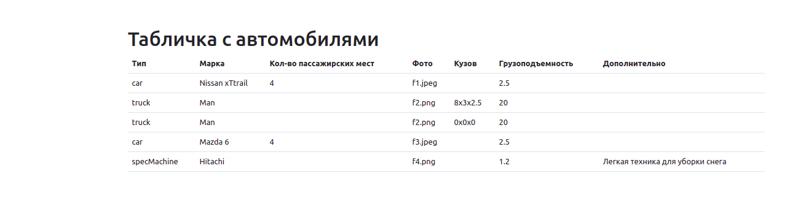

Задача, в основном, на применение паттернов проектирования. Сформировать массив из машин разных типов.

Попробовал реализовать на чистом php, без использования фреймворков, в том числе DI контейнер.

Данное тестовое создано с помощью этого репозитория путем удаления лишних деталей -
https://github.com/sergeysrabionyan/MVCBlog. А также добавления своих.

